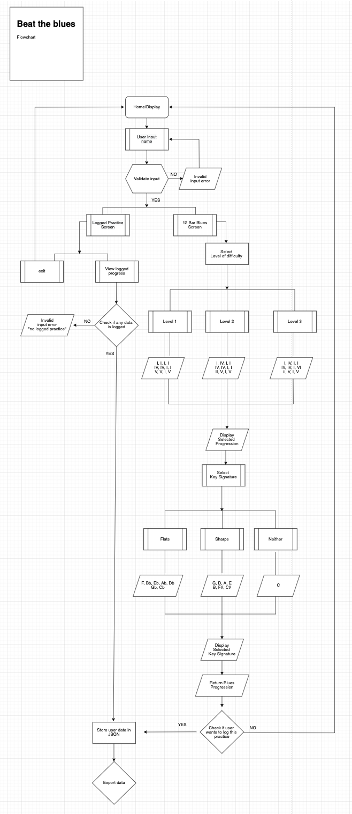

# BeatTheBlues

# Software Development Plan

- 

- 

## Purpose & Scope

- BeatTheBlues is a terminal app which generates a 12 bar blues chord progression for beginner musicians. 

- Practicing music, like playing an instrument is a skill. The skills of practicing an instrument effectively can be a particularly challenging skill to learn for the beginner musician in addition to learning various techniques to play an instrument. 

- As a student of music and a music tutor, I have seen musicians struggle with knowing what to practice and keeping track of their progress. This is why I am building this app. 

## What problem does BeatTheBlues solve?

- The first aim of BeatTheBlues is to help beginning musicians learn 12 bar blues variations in all twelve keys. 

- The second aim of the app is to help beginning musicians decide what to practice in a given session. In short, alleviate decision fatigue. 

- Finally, the app can track/save and load the progress of the users.

## Target Audience

- Beginner musicians.

- A basic knowledge of music theory is helpful (specifically how to build major and minor chords).

- The app is particularly useful for people wanting to learn music as a hobby and who don’t have access to a private tutor. 

# Features

# User Interaction and Experience 

# Diagrams

Flowcharts can be found [here.](https://github.com/IsaacCavallaro/IsaacCavallaro_T1A3/tree/master/docs/flowcharts)

# Implentation Plan

# Help Files

Help documentation can be found [here.](https://github.com/IsaacCavallaro/IsaacCavallaro_T1A3/blob/master/docs/help.md)