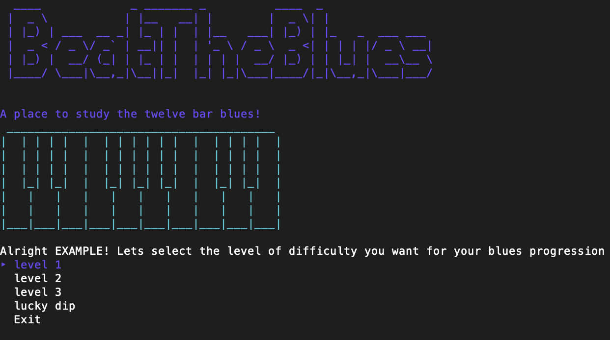

# BeatTheBlues

Created by Isaac Cavallaro @CoderAcademy May 2021.

# Installation

- You will need to have **ruby installed** on your computer before running BeatTheBlues. For more information on how to install ruby please view the help documentation which can be found [here.](https://github.com/IsaacCavallaro/IsaacCavallaro_T1A3/blob/master/docs/help.md)

- You will also need to install the required **ruby gems**. For more information on how to install ruby gems please view the help documentation which can be found [here.](https://github.com/IsaacCavallaro/IsaacCavallaro_T1A3/blob/master/docs/help.md)

- The app has not been tested with a Windows Operating system. For more information on running a .sh file on Windows, click [here](https://www.webservertalk.com/run-sh-files-in-linux-and-windows/).

## Steps to install BeatTheBlues (Linux or Unix)

1. Open up terminal 

2. Change to a directory you wish to install BeatTheBlues to (Download for example)

        cd Downloads

1. Clone the git repo to your computer. For more information on how to clone a repository click [here.](https://docs.github.com/en/github/creating-cloning-and-archiving-repositories/cloning-a-repository-from-github/cloning-a-repository)

        git clone https://github.com/IsaacCavallaro/IsaacCavallaro_T1A3.git

2. Change to the directory that contains the repository.

        cd IsaacCavallaro_T1A3

3. cd to the src directory.

        cd src

7. Type this code into the terminal to start the application.

        ./run_app.sh

If that didn't work please view the help documentation which can be found [here.](https://github.com/IsaacCavallaro/IsaacCavallaro_T1A3/blob/master/docs/help.md)

# Link to Repo

- A link to the source control repository can be found [here](https://github.com/IsaacCavallaro/IsaacCavallaro_T1A3/tree/master/src).

# Software Development Plan

## Purpose & Scope

- Practicing music, like playing an instrument is a skill. The skills of practicing an instrument effectively can be a particularly challenging skill to learn for the beginner musician; in addition to learning various techniques to play an instrument. 

- As a student of music and educator, I have seen musicians struggle with knowing what to practice and keeping track of their progress. This is why I am building this app. 

- BeatTheBlues is a terminal app which generates a 12 bar blues chord progression for beginner musicians. 

- Specifically, BeatTheBlues allows beginner musicians to identity the roman numeral
relationship between three levels of a major blues chord progressions and a given key signature. This includes key signatures which incorporate flats, sharps or neither (natural).

**Example**: Simple 12 bar blues chord progression: 

        
        I, I , I, I
        IV, IV, I, I
        V, V, I, V 
In the key of C this would be: 

        C, C, C, C
        F, F, F, F
        G, G, C, G

- In BeatTheBlues, this would be a *Level 1* and *Natural* selection. 

**Example 2**: Slightly more challenging 12 bar blues chord progression: 

        I, IV , I, I
        IV, IV, I, I
        V, IV, I, V 

        C, F, C, C
        F, F, C, C
        G, F, C, G

- In BeatTheBlues, this would be a *Level 2* and *Natural* selection. 

## What problem does BeatTheBlues solve?

- The first aim of BeatTheBlues is to help beginning musicians learn 12 bar blues variations in all twelve keys. 

- The second aim of the app is to help beginning musicians decide what to practice in a given session. In short, alleviate decision fatigue. 

- Finally, the app can track/save and load the progress of the users; aiding in the development of learning blues progressions.

## Target Audience

- Beginner musicians.

- A basic knowledge of music theory is helpful (specifically how to build major and minor chords).

- The app is particularly useful for people wanting to learn music as a hobby and who don’t have access to a private tutor. 

- Each BeatTheBlues progression can be applied to piano or guitar to build chords on. Alternatively users can practice soloing over the progression with a chosen instrument (Saxophone, Trumpet etc).

## Why use BeatTheBlues?

- Beginner musicians have enough to think about when it comes to learning an instrument. Therefore, by including BeatTheBlues to their practice routine, beginner musicians are directed with what to practice and how to keep track of their practice and progress.

- After installing  BeatTheBlues, users can start using the features of the app instantly with the app prompting users through each step. For more information on how to use BeatTheBlues, please view the help documentation which can be found [here.](https://github.com/IsaacCavallaro/IsaacCavallaro_T1A3/blob/master/docs/help.md)

- With the apps simple design, easy installation, adding BeatTheBlues to a practice routine will make learning music fun.

# Features

## Feature 1.1

- Users can specify the complexity (the number of chord changes) in the suggested progression.

- Users can select from three differing levels of difficulty; level 1, level 2, level 3. 

##  Example of Feature 1.1

- The two pictures below illustrate the user "EXAMPLE" selecting level 1 and the returned progression in Roman Numerals.

- Before moving on, BeatTheBlues will display this progression to the user and check if they are ready to move on. 

- This way the user can easily reselect a new level/progression if they wish; without having to exit the application.

# Selecting levels 

- Levels can be selected with the up and down arrows on the keyboard (See image below).

## Feature 1.2

- Users can specify if they want their selected progression to include flats, sharps or neither (natural). 

# Selecting keys

- Keys can be selected with the up and down arrows on the keyboard (See image below).

## Feature 2

- Users can select the lucky dip option which will output a random 12 bar blues progression.
This will output a progression that could be from either level one, level two or level three difficulty and could be from any of the twelve keys. 

- Lucky dip can be selected with the up and down arrows on your keyboard.

## Feature 3 - Practice Log

- Users can save their progress under their username.

- Multiple usernames can be stored and retrieved.

- Data can be stored and view at the start of the app and after a progression has been displayed.

# Adding to Practice Log (Before displayed progression)

- To add to a practice log before a displayed progression, users can select *Practice log* with the up and down arrows on their keyboard (See image below)

# Adding to Practice Log (After displayed progression)

- In order to add to the practice log after a displayed progression, users can select *Store this session in your practice log?* with the up and down arrows on their keyboard (See image below).

# Checking Practice Log

- To check a practice log before a displayed progression, users can select *Practice log* with the up and down arrows on their keyboard and then select *Check Practice log* (See image below).

# User Interaction and Experience 

- For more information on user interaction and experience view the help documentation which can be found [here.](https://github.com/IsaacCavallaro/IsaacCavallaro_T1A3/blob/master/docs/help.md)

# Errors

- The most likely place for BeatTheBlues to error is when storing and retrieving data from the practice log. 

- While BeatTheBlues has been designed with error handling in mind, sometimes mistakes are made. In the rare case that an error occurs, BeatTheBlues aims to handle errors gracefully by displaying simple messages to the user.  

**Error example one:**

        Could not find file

**Error example two**

        Input is not valid Json

# Diagrams

Flowcharts can be found [here.](https://github.com/IsaacCavallaro/IsaacCavallaro_T1A3/tree/master/docs/flowcharts)

# Implentation Plan

- To keep track of implementing each feature, I used trello. (link to trello). To make full use of trello, I used a combination of label colours and deadlines to see what action I needed to do next.

- In addition to using colours and deadlines, I used the trello checklist for implementing each feature of BeatTheBlues.

 A link to all my trello screenshots can be found [here](docs/trello_screenshots)

# Help Files

Help documentation can be found [here.](https://github.com/IsaacCavallaro/IsaacCavallaro_T1A3/blob/master/docs/help.md)

# References

- Ruby Gems 

https://rubygems.org/

- Stackoverflow

https://stackoverflow.com/

- The Windows Club

https://www.thewindowsclub.com/how-to-run-sh-or-shell-script-file-in-windows-10

- Draw 

https://app.diagrams.net/
