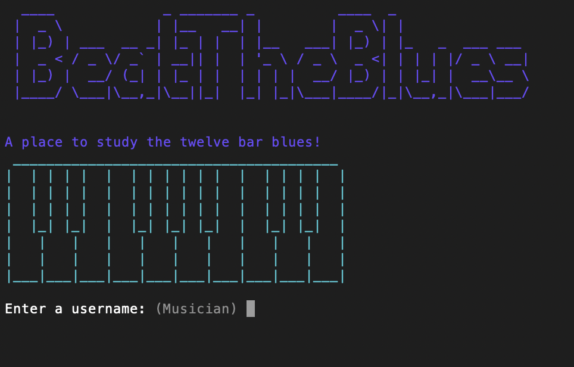

# How to install BeatTheBlues - Mac

# How to install BeatTheBlues - Windows

https://www.thewindowsclub.com/how-to-run-sh-or-shell-script-file-in-windows-10

# How to use BeatTheBlues

- BeatTheBlues has been designed for beginner musicians with useability in mind. Therefore, the installation process has been intentionally kept simple. In the same manner, accessing each feature of BeatTheBlues has been designed with simplicity in mind. 

- At each stage of selection in BeatTheBues, users are prompted with simple questions and BeatTheBlues will guide the user with what action is required. 
BeatTheBlues will allow the user to exit the application from almost any location of the app or return to the previous selection after making a selection. 

# Username

- If you do not wish to include a username, BeatTheBlues will automatically default the username to *Musician* by simply pressing the enter/return key on the keyboard (See image below).

# Requirements

- BeatTheBlues requires the user to have **Ruby installed** and the **Ruby Gems installed**; detailed in the gem file and listed below. 

- Without installing the ruby gems, the user experience will be negatively impacted as some of the features of BeatTheBlues will not be accessible.

# Gems

- tty-prompt version 0.23.1

- rspec version 3.10"

- colorize version 0.8.1

- artii version 2.1

- json version 2.5

- pry version 0.14.1

# Links to install Gems

- Click [here](https://rubygems.org/gems/tty-prompt) to install tty-prompt

- Click [here](https://rubygems.org/gems/colorize) to install colorize

- Click [here](https://rubygems.org/search?query=artii) to install Artii

- Click [here](https://rubygems.org/gems/json)to install Json

- Click [here](https://rubygems.org/search?query=pry) to install pry (Although this gem is not required to run the app)

# Helpful Links

If you are having trouble installing Ruby click [here](https://www.ruby-lang.org/en/documentation/installation/).

If you are having trouble installing Bundler click [here](https://help.dreamhost.com/hc/en-us/articles/115001070131-Using-Bundler-to-install-Ruby-gems).

